

  <h1 align="center">
    Proceso Automatizado de Evaluación de desempeño 360 con Agente de IA
       
      
       
  </h1>

# Contenido

* [Descripción](#descripción})
* [Stack Tecnológico](#stack-tecnológico)
* [Arquitectura RAG](#arquitectura-RAG)
* [Observaciones](#observaciones)
* [Workflow](#workflow)
* [Diagrama Entidad Relación](#diagrama-entidad-relación)
* [Procedimientos Almacenados y Funciones PL/SQL utilizados en los nodos](#procedimientos-almacenados-y-funciones-plsql-utilizados-en-los-nodos)
* [Plantillas Blade](#plantilla-blade)
* [Producto Final](#producto-final)

## Descripción 
Este proceso automatizado con un agente de IA como Consultor 360 surge para responder a la necesidad de la empresa de encontrar una solución con IA que optimice y ahorre recursos en el proceso de evaluación. Este agente resuelve el sesgo subjetivo que suelen presentarse en las evaluaciones de desempeño tradicionales. Al actuar como un consultor experto, el agente integra y analiza volúmenes de datos, eliminando la carga administrativa de tabular respuestas manualmente, permitiendo una entrega de resultados inmediata y estandarizada. Así, se garantiza que cada colaborador reciba una retroalimentación justa, técnica y profundamente alineada con los objetivos estratégicos de la organización.

## Stack Tecnológico
- **Orquestador**: n8n (versión 1.123.22).
- **Backend & Carga de Datos**: Laravel (utilizando plantillas Blade para la estandarización).
- **Fuente de Entrada**: Google Sheets (como interfaz de gestión administrativa).
- **Base de Datos Relacional**: PostgreSQL (donde se consolidan y estructuran los datos de evaluación tras el flujo de sincronización).
- **LLM**: OpenAI GPT-4o.
- **Metodología RAG**: Recuperación de contexto basada en datos estructurados (SQL) en lugar de búsqueda vectorial tradicional.

## Arquitectura RAG: 

El flujo de los datos, se maneja de forma cíclica y estructurada a través de las siguientes etapas:

1. **Entrada de Datos (Carga Masiva)**: La información inicial (nombres, cargos, correos, etc.) se extrae desde un Google Sheet para alimentar la base de datos de empleados.
2. **Procesamiento y Validación**: Antes de cualquier inserción, el flujo utiliza nodos de JavaScript para formatear datos críticos como las fechas de ingreso. Posteriormente, consulta en PostgreSQL si el empleado o la relación de evaluación ya existen para evitar duplicados.
3. **Almacenamiento Estructurado**: Las calificaciones y relaciones se guardan en tablas de PostgreSQL mediante llamadas a procedimientos almacenados como insertar_detalle_evaluacion e insertar_relacion_evaluacion.
4. **Transformación para Reportes**: Para generar el informe, el sistema recupera los promedios y porcentajes calculados en la base de datos. Estos datos numéricos se envían a la API de QuickChart para transformarlos en gráficas visuales (radar y barras).
5. **Salida de Información**: Finalmente, los resultados procesados y las imágenes de las gráficas se integran en una plantilla HTML para ser enviados por correo electrónico a cada evaluado.

## Observaciones

Este sistema implementa una arquitectura RAG basada en datos estructurados que sustituye las bases de datos vectoriales por una fuente de conocimiento en Google Sheets. La gestión se realiza desde Laravel, utilizando plantillas Blade para estandarizar la carga de información. Posteriormente, un flujo automatizado sincroniza estos datos hacia tablas en PostgreSQL, permitiendo que el agente de IA consulte registros organizados y precisos. Esto garantiza una recuperación de datos exacta, auditable y fácilmente gestionable por el equipo administrativo.

## Workflow

Haz clic en el siguiente enlace para obtener el archivo JSON con la configuración integral del flujo: nodos, integración de agentes de IA y modelos relacionales.

[Descargar el Workflow de Evaluación 360](https://raw.githubusercontent.com/ing-jhparra/Agente-IA-360/refs/heads/main/scripts/Evaluacion%20360.json)

## 1. Carga de Empleados

Este flujo automatiza la sincronización de personal extrayendo datos de Google Sheets para procesarlos individualmente. Tras limpiar y formatear atributos como la fecha de ingreso, el sistema valida la existencia de cada registro en la base de datos para evitar duplicados. Si el empleado es nuevo, se inserta automáticamente; de lo contrario, el proceso continúa hasta completar la lista.

  <h1 align="center">
       
      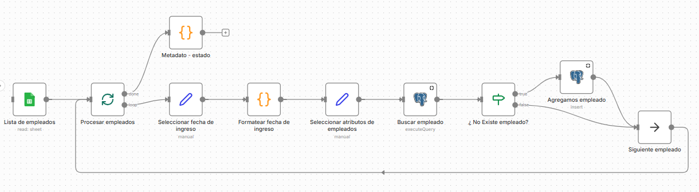
       
  </h1>

## 2. Carga de Configuracion de Relaciones.

Este flujo de trabajo automatiza la configuración de relaciones entre evaluadores y evaluados. El proceso inicia extrayendo una lista de configuraciones desde un Google Sheet, transformando fechas y filtrando atributos clave. Posteriormente, realiza búsquedas cruzadas en la base de datos para identificar a los participantes y definir su vínculo; si la relación no existe previamente, el sistema la inserta de forma automática. Al finalizar el recorrido de la lista, el flujo genera un estado de confirmación del proceso.

  <h1 align="center">
       
      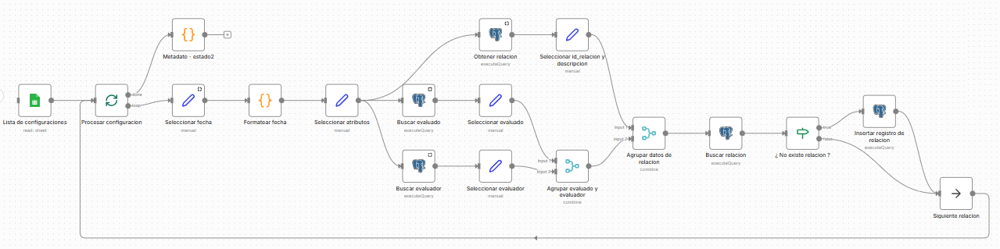
       
  </h1>

## 3. Carga de Calificaciones y Calculos.

Este flujo automatiza la carga y validación de evaluaciones desde una hoja de cálculo hacia una base de datos. El proceso recorre cada evaluación para identificar relaciones y competencias, prepara los datos y verifica si el registro ya existe; en caso de ser nuevo, lo inserta en el sistema. Finalmente, una vez procesada toda la lista, el flujo ejecuta una tarea de cierre para calcular y actualizar los totales generales.

  <h1 align="center">
       
      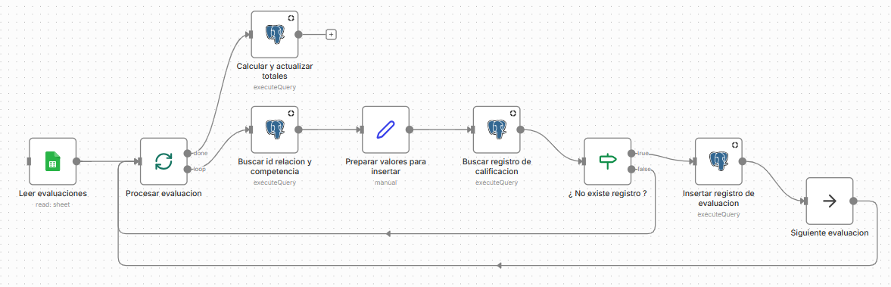
       
  </h1>

## 4. Generar Reportes Estadisticos.

Este flujo de trabajo automatiza la generación de reportes de evaluación detallados para cada empleado. El proceso inicia listando a los evaluados desde la base de datos y, mediante un bucle, extrae simultáneamente sus resultados, valores mínimos/máximos, porcentajes por competencia y estadísticas generales.

Con esta información, el sistema genera dinámicamente varios componentes visuales:

- **Gráficas**: Crea representaciones de tipo radar, barras verticales y horizontales.
- **Conversión**: Transforma tanto las gráficas como las tablas estadísticas a formato HTML.
- **Consolidación**: Agrupa todos los elementos en una plantilla de informe única, calcula los promedios finales e inserta el registro de evaluación terminado en la base de datos antes de pasar al siguiente empleado.

  <h1 align="center">
       
      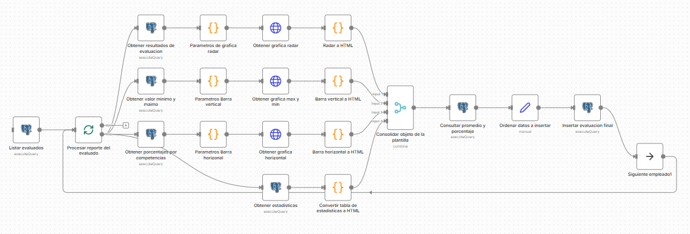
       
  </h1>

## 5. Evaluación 360 por el Agente de IA.

Este flujo de trabajo implementa un agente de IA para la consultoría de evaluaciones 360. El proceso comienza extrayendo los identificadores de los evaluados desde la base de datos y los procesa individualmente mediante un bucle.

Se destaca :

- **Inteligencia Artificial**: Utiliza un nodo de agente **Consultor en Evaluación 360** conectado a un modelo de OpenAI, con memoria y una herramienta específica para obtener estadísticas de la base de datos, permitiendo generar análisis cualitativos personalizados.
- **Procesamiento de Texto**: Los resultados del análisis de la IA se formatean de Markdown a HTML para asegurar una presentación profesional.
- **Gestión de Información**: El flujo actualiza los datos de los empleados, recupera la información final de la evaluación y construye una plantilla de correo electrónico personalizada para cada trabajador antes de pasar al siguiente registro.

  <h1 align="center">
       
      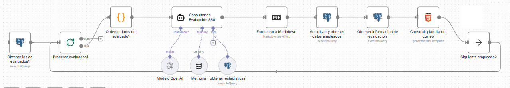
       
  </h1>

## 6. Enviar reporte por correo al Evaluador.

Este flujo de trabajo automatiza la notificación de resultados de evaluación vía correo electrónico. El proceso comienza preparando los datos del empleado y el destinatario, actualiza y recupera la información necesaria desde la base de datos de PostgreSQL, y utiliza estos datos para construir una plantilla personalizada en formato HTML. Finalmente, el sistema utiliza el nodo de Gmail para enviar automáticamente el resultado final al evaluado.

  <h1 align="center">
       
      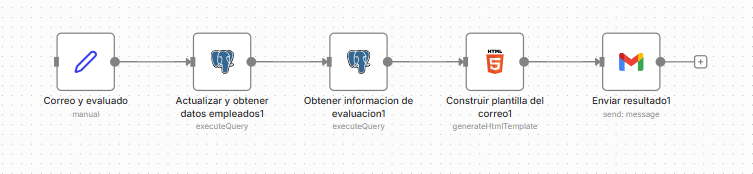
       
  </h1>

## Diagrama Entidad Relación

Este es el diagrama de entidad-relación que sustenta todo el sistema de evaluación 360 que hemos revisado. Estructuralmente, está diseñado para gestionar la complejidad de múltiples evaluadores por cada empleado y consolidar esos datos en informes finales.

Aquí tienes un resumen de los componentes principales:

- **Núcleo de Gestión de Personal**: Las tablas empleado y unidad organizan la estructura organizacional, vinculando a cada trabajador con su departamento y datos de contacto.
- **Configuración de Evaluaciones**: La tabla relacion_evaluacion es el puente crítico; conecta al evaluado con su evaluador, define el tipo_relacion (como jefe, colega o subordinado) y lo enmarca en un periodo_evaluacion específico.
- **Captura de Datos**: La tabla detalle_evaluacion almacena las calificaciones individuales por cada area_competencia, permitiendo un desglose granular de los resultados.
- **Consolidación y Reportes**: 
    - **totales**: Almacena los promedios calculados por área para facilitar la generación de estadísticas.
    - **evaluacion_final**: Es la tabla de salida donde se guardan los promedios globales, porcentajes de cumplimiento y los fragmentos de código (como los campos radar, tabla y resumen_ejecutivo) que vimos generarse en los flujos de automatización anteriores.

  <h1 align="center">
       
      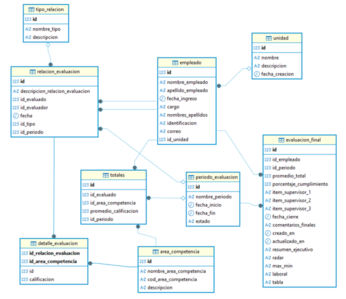
       
  </h1>

## Procedimientos Almacenados y Funciones PL/SQL utilizados en los nodos

Esta tabla representa el diccionario de funciones y procedimientos almacenados que conectan tus flujos de n8n con la base de datos PostgreSQL. Es la capa de lógica que permite que los nodos de "Execute Query" realicen acciones específicas de forma estandarizada.

Podemos agrupar estas funciones según su propósito dentro del proceso automatizado:

  - **Consultas de Identificación (SELECT)**: Utilizadas para validar la existencia de registros o recuperar IDs específicos de relaciones, competencias y empleados (ej. buscar_id_area_competencia).
  - **Gestión de Evaluaciones y Resultados**: Funciones clave para extraer métricas cualitativas y cuantitativas, como los valores máximos/mínimos y los porcentajes por competencia que alimentan tus gráficas.
  - **Acciones de Escritura y Procesamiento (CALL)**: Procedimientos encargados de la carga física de datos y el cálculo de métricas agregadas (ej. actualizar_promedios_totales).
  - **Integración de Datos de Empleado**: Funciones que mantienen actualizada la información del personal y recuperan los datos finales para la construcción de los correos de notificación.

Esta arquitectura desacopla la lógica de negocio de la herramienta de automatización, facilitando que cualquier cambio en las reglas de evaluación se ajuste directamente en la base de datos sin necesidad de modificar todos los flujos.

| Nodo                                   | Tipo   | Procedimiento / Función                  |
|----------------------------------------|--------|------------------------------------------|
| Buscar id relación y competencia       | SELECT | buscar_id_relacion_evaluacion            |
| Buscar id relación y competencia       | SELECT | buscar_id_area_competencia               |
| Buscar registro calificación           | SELECT | buscar_registro_calificacion             |
| Insertar registro evaluación           | CALL   | insertar_detalle_evaluacion              |
| Calcular y actualizar totales          | CALL   | actualizar_promedios_totales             |
| Buscar relación                        | SELECT | buscar_relacion_evaluacion               |
| Insertar registro relación             | CALL   | insertar_relacion_evaluacion             |
| Buscar empleado                        | SELECT | buscar_empleado_identificacion           |
| Resultados evaluación                  | SELECT | obtener_datos_evaluacion_empleado        |
| Valor mínimo y máximo                  | SELECT | obtener_max_min_competencias             |
| Porcentajes por competencias           | SELECT | obtener_estadisticas_evaluado            |
| Información evaluación                 | SELECT | obtener_datos_evaluacion_empleado        |
| Actualizar y obtener datos empleado    | SELECT | actualizar_y_obtener_datos_empleado      |

## Plantillas Blade

Aunque inicialmente el proyecto se concibió utilizando Google Sheets como fuente de datos, decidimos evolucionar hacia una arquitectura más robusta basada en PostgreSQL. Esta transición no solo garantiza una mayor integridad y escalabilidad en el tratamiento de la información, sino que permite explotar todo el potencial de n8n. En lugar de realizar inserciones directas en tablas, optamos por orquestar el flujo completo a través de n8n para validar sus capacidades de automatización avanzada y gestión de procesos complejos.

Para elevar el nivel técnico y estético del proyecto, integramos plantillas Blade de Laravel en lugar de las opciones nativas de n8n. Esta decisión estratégica permitió desacoplar la lógica de presentación, facilitando una estructuración de datos mucho más limpia y profesional antes de ser enviada a las hojas de Google Sheets.

  <h1 align="center">
       
      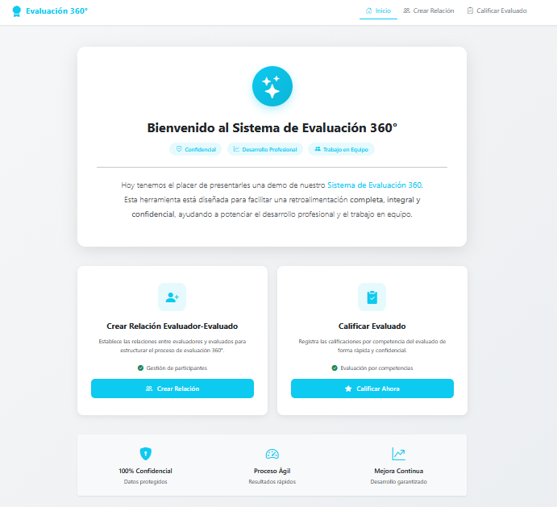
       
  </h1>

El sistema cuenta con un formulario especializado que gestiona la creación de la relación Evaluado-Evaluador. En esta etapa, se define el rol jerárquico del proceso (Supervisor, Compañero, Subordinado o Cliente), enviando automáticamente los datos estructurados hacia una hoja de Google Sheets para su posterior procesamiento y análisis.

  <h1 align="center">
       
      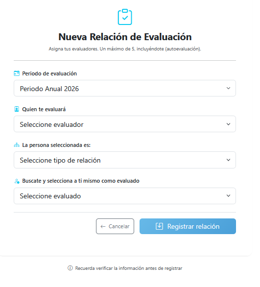
       
  </h1>

Siguiendo la misma lógica, el proceso de calificación se gestiona a través de un formulario optimizado que facilita el registro de las evaluaciones. Los datos recolectados se sincronizan en tiempo real con la hoja de Google Sheets, asegurando que cada calificación quede centralizada y lista para ser procesada.

  <h1 align="center">
       
      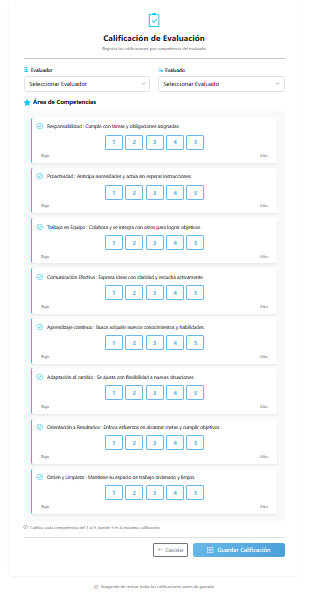
       
  </h1>

## Producto Final

El proceso cierra el ciclo de talento enviando un correo al supervisor inmediato con los resultados de la evaluación y una propuesta de actividades de crecimiento, transformando los datos en un plan de acción real para el desarrollo del personal.

  <h1 align="center">
       
      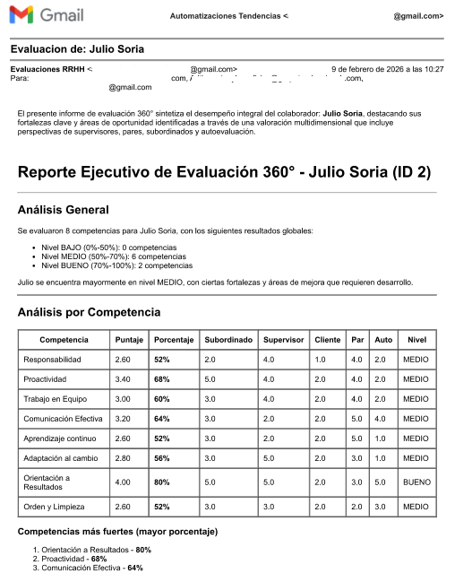
       
  </h1>

  <h1 align="center">
       
      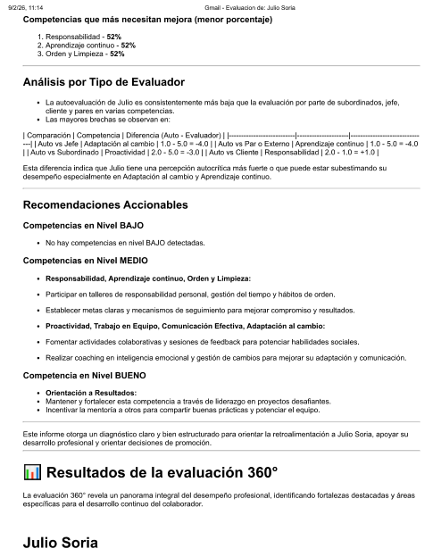
       
  </h1>

  <h1 align="center">
       
      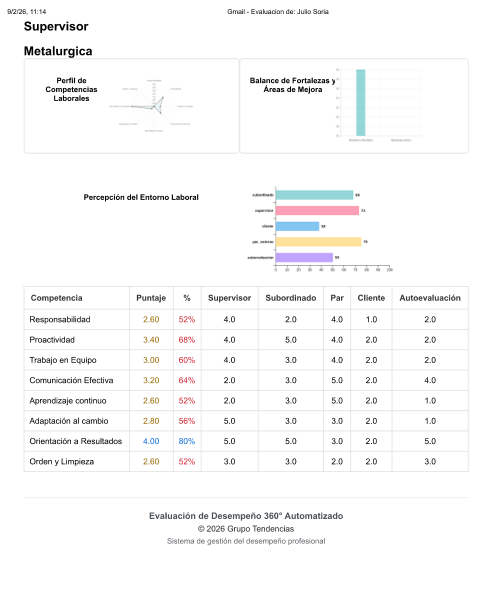
       
  </h1>

## Autor

| [ Jesus H. Parra B.](https://github.com/ing-jhparra)
| :---: |